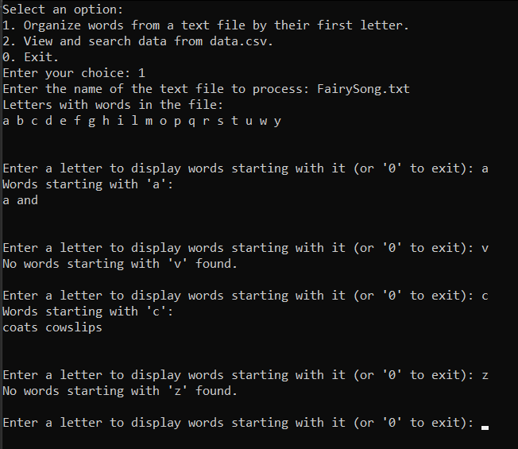
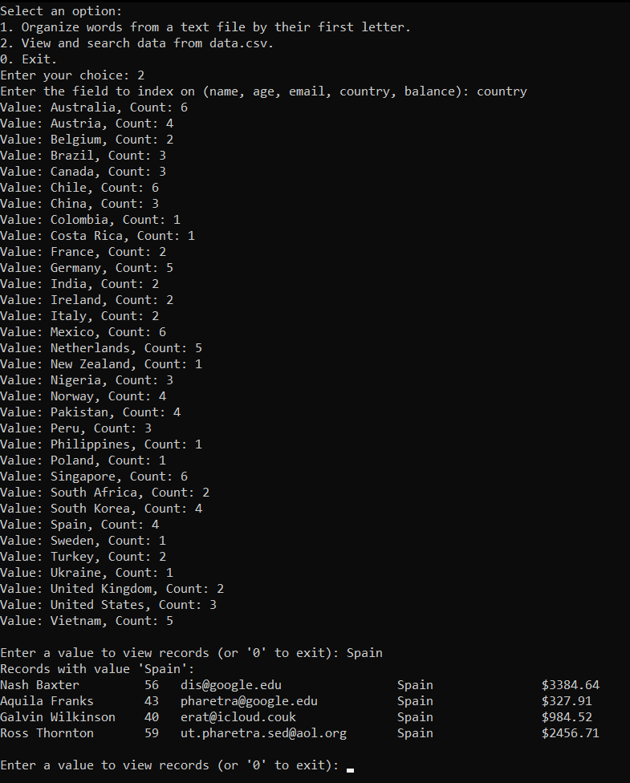

# ADS_CA2_Roman_Manzhelii

This project focuses on designing and implementing a non-linear data structure using C++.<br>
Gaining practical experience with C++ unit testing.<br>
Demonstrating the use of advanced C++ concepts such as templates, functors, and predicates.<br>
The goal is to create an efficient and robust data structure while showcasing modern C++ programming techniques.

## Installation

```bash
git clone https://github.com/Roman-Manzhelii/ADS_2024_CA2_Roman_Manzhelii.git
cd ADS_2024_CA2_Roman_Manzhelii
```

Double click on `ADS_2024_CA2.sln`

## Result

### Task 1:


### Task 2:


## Contributing

Pull requests are welcome. For major changes, please open an issue first
to discuss what you would like to change.

Please make sure to update tests as appropriate.

## License

[MIT](https://choosealicense.com/licenses/mit/)